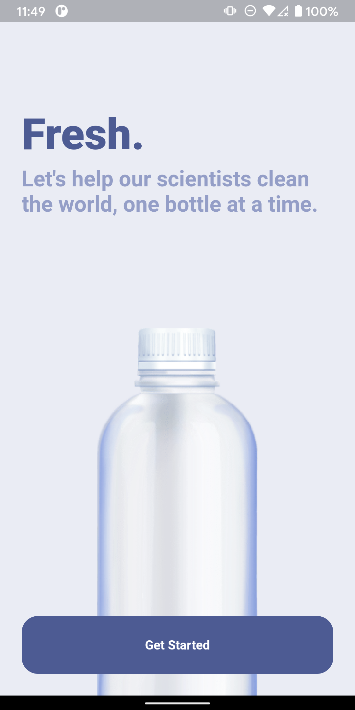
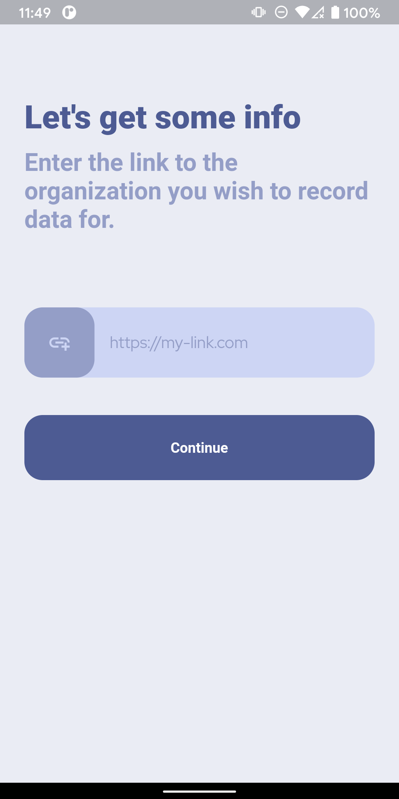
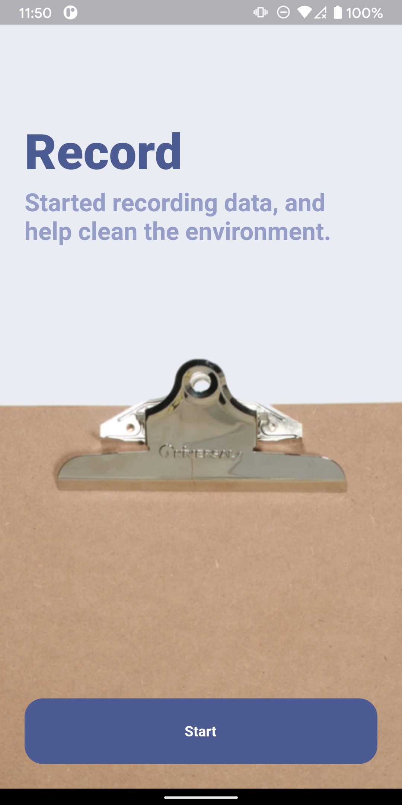
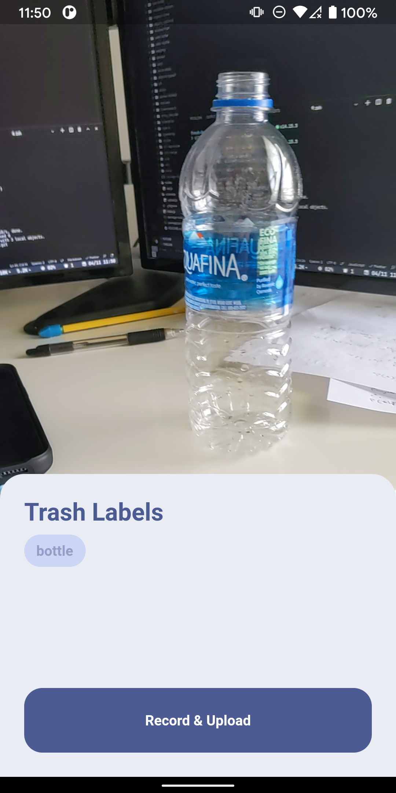
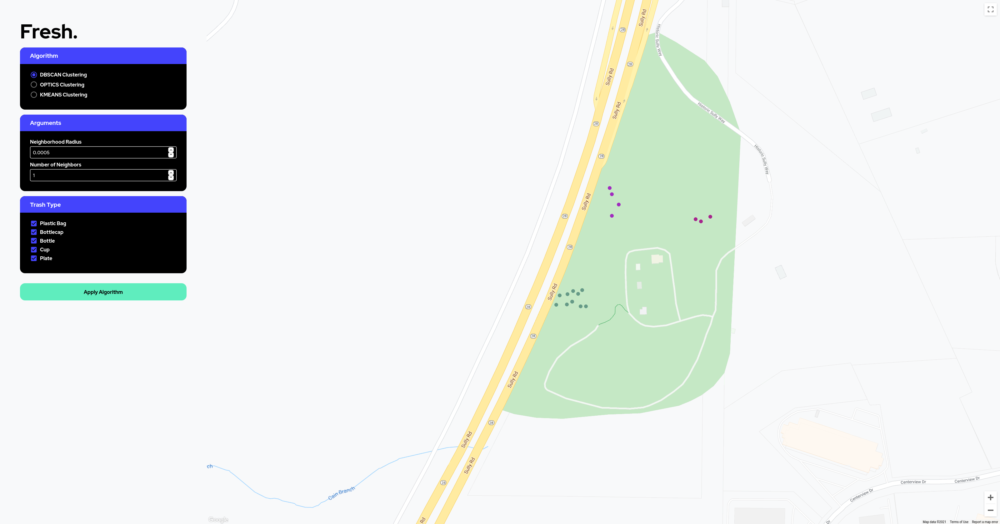

# Fresh    
#### By Autin Mitra, Andrew Lam, Andrew Xie, and David Liu     

⭐ hacktj best mobile winner, nice

## What is Fresh?
Fresh is a tool that is used to record and display locations of trash found outside.    

## Why?     
Scientists approximate we have 5-6 years left to save the environment. We created Fresh to combat this problem. 

We created Fresh as a platform to mutually accommodate data scientists, environmentalists, and volunteers in cleaning up the environment. By using Fresh, volunteers can automate the process of trash labeling and recording, allowing researchers to gain access to valuable data for research. 

With fresh, we believe that we can help mitigate the process of climate change.

## What technologies does it use?    
We used Flutter for the mobile app and used Google's [MobileNet](https://www.tensorflow.org/lite/guide/hosted_models) in combination with [TFLite](https://www.tensorflow.org/lite) to detect trash in an image.     
For the backend, we utilized ExpressJS and MongoDB to host our website & API.       
For the front-end visuals, we used GatsbyJS with theme-UI. [google-map-react](https://github.com/google-map-react/google-map-react) was used to display the map and [framer-motion](https://www.framer.com/motion/) was used for fancy-pants animations.      

## How does it work?   
The fresh mobile app can be used to scan the environment for trash. Upon finding a piece of trash, the app will identify the type of trash (plastic bag, bottles, etc.) and allows the user to upload an image of the trash, the GPS coordinates, and the type of trash to a server.

The backend receives the information and stores the GPS coordinates, image, and trash type in a database. The front-end retrieves this data, providing scientists with a multitude of analysis tools.

In the front-end, researchers/scientists/analysts/environmentalists can use various tools at their disposal to further analyze patterns in trash distribution. We provide density-clustering/clustering algorithms, including DBSCAN, OPTICS, and kMeans. Each algorithm can be customized with arguments, such as the # neighbors, neighbor radius, and the number of clusters. The data points are plotted in a Google Maps components, with different colors representing the labels and clusters. Furthermore, users can filter out different types of trash for a more precise analysis of distribution patterns.

## What improvements could we make to this?
- Add more analysis tools
- "Spaces" concept (multiple maps per organization)

## What challenges did we have?
The project was more complex than the usual projects we've accomplished, mainly due to the plethora of codebases we had to write. Usually, we would focus on a single platform (web, backend, app, etc.), but this time around, we wrote ALL 3. So in 24 hrs (alongside some sleep), we *somehow* managed to make a coherently functional integration of all three platforms.

Also, it's our first time integrating TFlite into a Flutter app, and due to weird dependency issues with TFLite and our models, we spent quite a bit of time debugging that.

TLDR: Lot's of code, so little time, but we did it 😳

## Bro, why didn't you use the state-of-the-art google-nvidia-stanford-carnegiemellon-georgiainsituteoftech-harvard-uva-nova-model for trash recognition, bro?!?!?!?!? 👁️👄👁️
This is a hackathon; we got ~24 hours (some of which I'd like to use for sleep), and gathering training data, waiting for it to train, and then building the necessary infrastructure to make it run is a huge PITA. Also, TFlite for Flutter is notoriously wacky sometimes, may as well run with something works (mobilenet).

# sheeeesh UI looking clean 😳😳😳
thanks *we* made it 😎

# lmfao why's its called fresh?
because we are braindead high schoolers that kinad just pulled the first word we could think of

[Figma Link](https://www.figma.com/file/QV2Isnrmc7lPy8rwxMTWh2/fresh?node-id=0%3A1)

# Screenshots

## We hope you enjoyed our project! 😳
